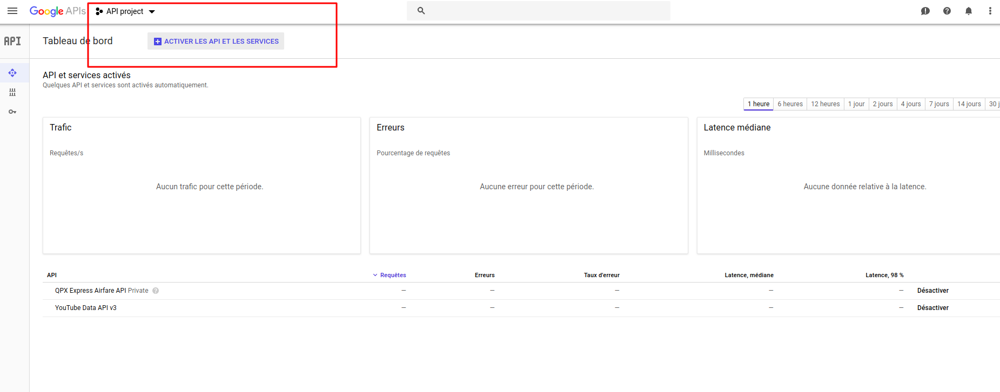
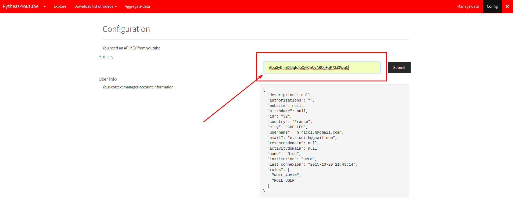

Pytheas user guide
======
##### ***User guide for the online application Pytheas***

**http://pytheas.cortext.net**

#### Summary

* [Pytheas User Guide](#Pytheas-User-Guide) 
	* [What is with Pytheas for youtube ?](#What-is-Pytheas-for-Youtube-?) 
	* [How to do with Pytheas for youtube ?](#How-to-do-with-Pytheas-for-youtube-?)
	* [Methodology](#Methodology)
	* [Get by Google the api Youtube Data V3 Key](#Get-by-Google-the-api-Youtube-Data-V3-Key)   
* [Explorer](#Exploration)
	* each videos
	* each channel
	* each playlist
* [Harvest parameter](#Harvest-parameter)
	* [the parts](https://developers.google.com/youtube/v3/getting-started#part)
	* [search by query youtube](#search-by-query-youtube)
	* [by channel](#By-channels)
	* [by playlist](#By-playlist)
	* [by list of selected videos](#By-list-of-selected-videos)
* [Data collections](#Data-collections)
	* [list of videos](#List-of-videos)
	* [list of comments associated with a video list](#list-of-comments-associated-with-a-video-list)
	* [list of subtitles associated with a video list](#list-of-subtitles-associated-with-a-video-list)
* [Exportation of data collection](#Exportation-of-data-collection)
    * JSON
* [Lexicon and keywords](#Lexicon-and-keywords)

## What is Pytheas for Youtube ?

Pytheas is an online interface designed to simplify and enhance the downloading of data related to youtube. 

Pytheas is linked to ** the youtube Data V3 ** API, provided by Google, which gives access to the following data: videos, authors' channels, playlist, comments, subtitles, etc.

## How to do with Pytheas for youtube ?

With the use of a [**free key provided by Google**](http://pytheas.cortext.net/manage) you will be **able to explore, gather and exporting data responded by Youtube**. 

Like **videos/channel/playlist** ; Possibly **horodated by a search query**. Including **comments and subtitles** if exists. Dowbloading them as **Json**.

## Methodology

The general methodology is as follows:
1.We download a set of videos according to some parameters (channel, search, playlist or list custom)
"Download list of videos"
2. Once the set of downloaded videos can be aggreger selected data chosen (comments, subtitles)
"Aggregate data"
3. We download our datasets in JSON
"Manage data"

## Get by Google the api Youtube Data V3 Key 

https://console.developers.google.com/apis

A complete set of APIs, provided by Google services

Possible to activate via its google account, access to Youtube APIs: there are 3 APIs for Youtube, the one we are interested in: 
**Youtube DATA API v3** 

https://console.developers.google.com/apis/library/youtube.googleapis.com?q=youtube%20data&id=125bab65-cfb6-4f25-9826-4dcc309bc508&project=api-project-154609&folder&organizationId

Once activated, we need to recover, a *** key api ***. This will allow us to authenticate with Google, to access data via Pytheas.

## Exploration 

https://pytheas.cortext.net/explore

Simply allow the data view that Google shows us, for:

- One video
- One channel
- One playlist

## Harvest parameter

A ** query ** in pytheas corresponds to a set of delimited videos according to criteria.

### search by query youtube

https://pytheas.cortext.net/get-data

Using the youtube search engine.

Default between 500 and 1000 videos (including a strong relevance for the first 500 only). Match the copy of the youtube search engine.

Need a language.

* Advance time stamped search
Time-stamped search allows you to repeat a query from the youtube search engine by calibrating it on a day. This makes it possible to extend considerably the sets harvested at the expense of declining relevance.

### By channels

Search videos by channel youtube.
https://pytheas.cortext.net/get-data

### By playlist

Search videos by playlist.

https://pytheas.cortext.net/get-data

### By list of selected videos

Also possible to harvest according to arbitrarily given video lists.

https://pytheas.cortext.net/get-data

## Data collections

#### List of videos

List of all the video recolected, with the basic information you set before.

(can be = 1)

#### List of comments associated with a video list

1 comments is always linked to a video. But give us all the comments liked to each video

#### List of subtitles associated with a video list

List of the automatic subtitles generated by youtube linked to each video as a plain text.

## Exportation of data collection

http://pytheas.cortext.net/manage

JSON 

## Lexicon and keywords
* Concepts API :
	* API 
	* API key
	* parts
* Ressources :
	* requests
	* list of videos
		* video
		* channel
		* playlist 
		* list of videos
	* comments
	* subtitles
* Methods of harvest
	* search by ressources (voir section 'ressources')
	* search by query Youtube
	* time stamped search
* Data collected :
	* list of videos
	* list of comments
	* list of subtitles
